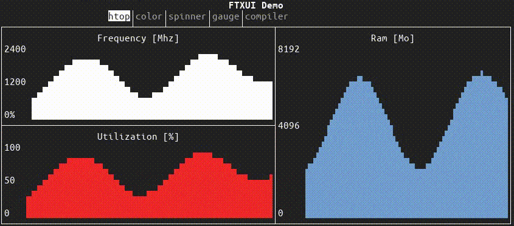

# FTXUI

[![travis][badge.travis]][travis]
[![issues][badge.issues]][issues]
[![license][badge.license]][license]
[![contributors][badge.contributors]][contributors]

[badge.travis]: https://img.shields.io/travis/com/ArthurSonzogni/FTXUI/master
[badge.issues]: https://img.shields.io/github/issues-raw/arthursonzogni/FTXUI
[badge.license]: https://img.shields.io/github/license/arthursonzogni/FTXUI?color=black
[badge.contributors]: https://img.shields.io/github/contributors/arthursonzogni/FTXUI?color=blue
[travis]: https://travis-ci.com/ArthurSonzogni/FTXUI
[issues]: https://github.com/ArthurSonzogni/FTXUI/issues
[license]: http://opensource.org/licenses/MIT
[contributors]: https://github.com/ArthurSonzogni/FTXUI/graphs/contributors

**Functional Terminal (X) User interface**

A simple C++ library for terminal based user interface.

## Demo:

## Feature
 * Functional style. Inspired by
   [[1]](https://hackernoon.com/building-reactive-terminal-interfaces-in-c-d392ce34e649?gi=d9fb9ce35901)
   and [React](https://reactjs.org/)
 * Simple and elegant syntax (in my opinion).
 * Support for [UTF8](https://en.wikipedia.org/wiki/UTF-8) and [fullwidth chars](https://en.wikipedia.org/wiki/Halfwidth_and_fullwidth_forms) (→ 测试)
 * No dependencies.
 * Cross platform (mostly). Linux (main target), Windows (experimental), Mac.

## Example:
~~~cpp
  vbox({
    hbox({
      text(L"left") | border,
      text(L"middle") | border | flex,
      text(L"right") | border,
    }),
    gauge(0.5) | border,
  });
~~~

~~~bash
┌────┐┌───────────────────────────────────────────────────────────────┐┌─────┐
│left││middle                                                         ││right│
└────┘└───────────────────────────────────────────────────────────────┘└─────┘
┌────────────────────────────────────────────────────────────────────────────┐
│██████████████████████████████████████                                      │
└────────────────────────────────────────────────────────────────────────────┘
~~~

# Documentation:

- [Starter example project](https://github.com/ArthurSonzogni/ftxui-starter)
- [Documentation](https://arthursonzogni.com/FTXUI/doc/) (Work in progress)
- [Build using CMake](https://arthursonzogni.com/FTXUI/doc/#build-using-cmake)
- [Build using nxxm](https://arthursonzogni.com/FTXUI/doc/#build-using-cmake)

## Project using FTXUI

Feel free to add your projects here:
- [chrome-log-beautifier](https://github.com/ArthurSonzogni/chrome-log-beautifier)
- [x86-64 CPU Architecture Simulation](https://github.com/AnisBdz/CPU)
- [ltuiny](https://github.com/adrianoviana87/ltuiny)
- [i3-termdialogs](https://github.com/mibli/i3-termdialogs)
- [Just-Fast](https://github.com/GiuseppeCesarano/just-fast)
- [simpPRU](https://github.com/VedantParanjape/simpPRU)
- [Pigeon ROS TUI](https://github.com/PigeonSensei/Pigeon_ros_tui)

## Hosted on:
 * [github](https://github.com/ArthurSonzogni/ftxui)
 * [gitlab](https://gitlab.com/ArthurSonzogni/ftxui)
